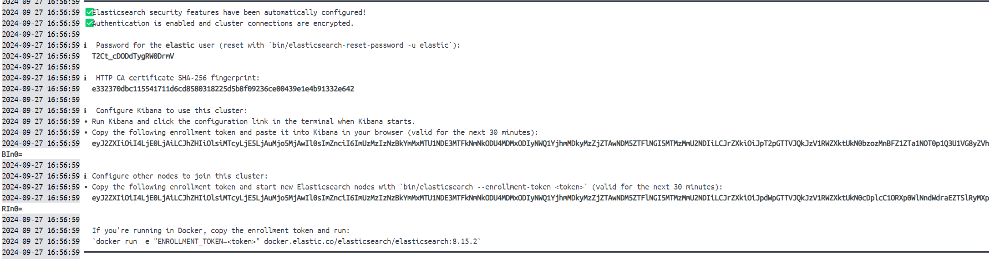

# Demo about Elasticsearch integrated with Spring Boot
https://spring.io/projects/spring-data-elasticsearch#learn

### Running Elasticsearch in Docker container
https://hub.docker.com/_/elasticsearch?uuid=9BF08200-5218-4C99-9584-7E49DA147AAA

https://www.elastic.co/guide/en/elasticsearch/reference/8.15/docker.html

I. With docker CLI commands:
1. Elasticsearch engine starting **without security**
  - docker pull elasticsearch:8.15.2 (docker pull docker.elastic.co/elasticsearch/elasticsearch:8.15.2)
  - docker network create elastic_network
  - docker run --name es01 --net elastic_network -p 9200:9200 -e "discovery.type=single-node" -e "xpack.security.enabled=false" docker.elastic.co/elasticsearch/elasticsearch:8.15.2

In below photo, `cluster_name` is `docker-cluster`:

After running for the first time our Spring application, the name of our document (table) is `product_index`:

  - docker container ls --all
  - docker container remove <container_id>
  - docker container prune

2. Kibana GUI for Elasticsearch starting **without security**
  - docker pull docker.elastic.co/kibana/kibana:8.15.2
  - docker run --name kib01 --net elastic_network -p 5601:5601 -e "ELASTICSEARCH_HOSTS=http://es01:9200" docker.elastic.co/kibana/kibana:8.15.2
  - GUI is available on localhost:5601

3. Elasticsearch engine starting **with security** enabled:
- docker run --name es01 --net elastic_network -p 9200:9200 -it -e "discovery.type=single-node" -e "xpack.security.enrollment.enabled=true" docker.elastic.co/elasticsearch/elasticsearch:8.15.2

II. With docker-compose file we benefit:
  - keeping/preserving data entered so far in a docker volume

### Test all the CRUD operations
Using POSTMAN and the resource http://localhost:8080/api/products

### Elasticsearch integrated search query API - based on Elasticsearch DSL (JSON)
https://www.elastic.co/guide/en/elasticsearch/reference/current/search-your-data.html

You can run this resource http://localhost:9200/product_index/_search on the browser to see the current available records for index `product_index`.

In case you want to search among all the tables (documents/indexes), then use http://localhost:9200/_search

If you run this resource http://localhost:9200/product_index/_search from Postman (allowed: [GET, POST]), 
you can specify specific search options in the body request:
- `{"query": {"match": {"id": 101}}}`
- `{"query": {"wildcard": {"name": "m*"}}}` - searching caseInsensitive where `name` begins with `m`
- `{"query": {"match_all": {}}}`

### Overriding Elasticsearch DSL search API with Java
- run GET on `localhost:8080/api/matchall` - searches in all indexes (documents/tables)
- run GET on `localhost:8080/api/products/matchallproducts` - searches in index `product_index`
- run GET on `localhost:8080/api/products/matchallproducts/{fieldValue}` - searches in index `product_index` with that fieldValue  